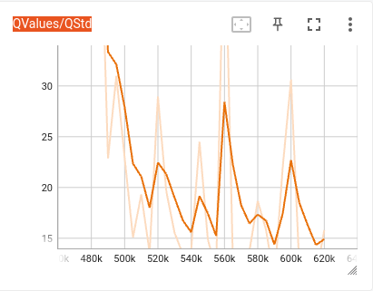
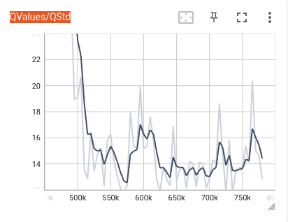
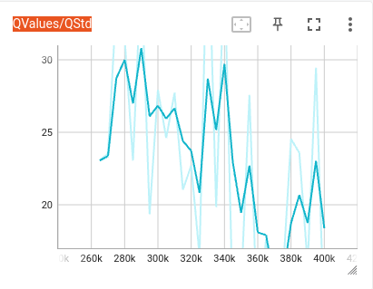
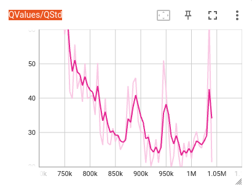
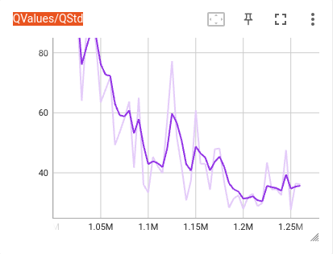
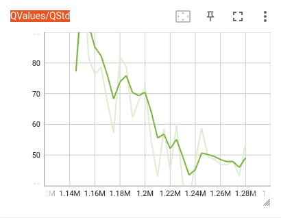
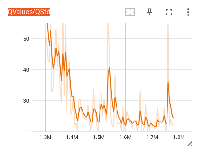
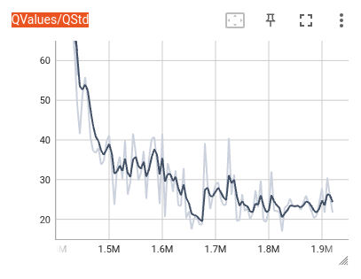
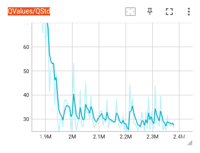
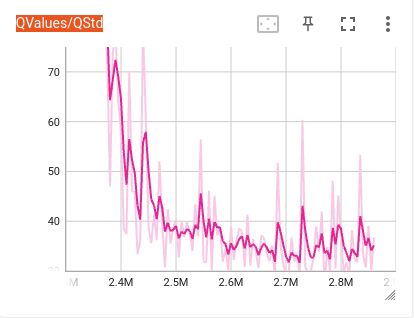

# QStd Analysis: LL_10 → LL_23

**What QStd measures:** the spread of Q-values across all actions and all sampled states in a training batch. A *growing* QStd means the network is still deciding how different it thinks actions are. A *flat* QStd means the value estimates have stopped changing — the agent has formed a stable opinion.

---

## Phase 1 — Learning from scratch (LL_10)

| Run | Start | Q1 avg | Q2 avg | Q3 avg | Q4 avg | End | Best return |
|---|---|---|---|---|---|---|---|
| LL_10 | 1.2 | 3.8 | 12.0 | 16.4 | 20.1 | 13.1 | −109 |

QStd grows monotonically from 1 → 24 with no plateau anywhere. The network is still discovering the value structure from random. No stabilization at all.

---

## Phase 2 — Early warm-start chain (LL_11 → LL_16): partial stabilization at low QStd

| Run | Start | Q1 avg | Q2 avg | Q3 avg | Q4 avg | End | Best return |
|---|---|---|---|---|---|---|---|
| LL_11 | 31.3 | 12.7 | 10.0 | 12.0 | 9.0 | 7.4 | −92 |
| LL_13 | 28.2 | 20.7 | 14.5 | 14.7 | 8.9 | 17.6 | −95 |
| LL_14 | 50.8 | 25.1 | 18.7 | 19.1 | 16.5 | 15.8 | −111 |
| LL_15 | 50.8 | 18.7 | 14.7 | 13.5 | 14.7 | 12.8 | −91 |
| LL_16 | 23.1 | 27.2 | 25.9 | 20.0 | 18.6 | 11.4 | −140 |

**Pattern:** Each run starts with a spike (inherited from the prior run's diverged weights + fresh replay buffer) then descends to a floor of **9–17**. In TensorBoard you will see a sharp drop-off in the first 20–30% of training, then a low, noisy plateau.

This *looks* like stabilization but it is actually the signal of a policy that is **not confident** — QStd is low because most actions look similarly bad. The network cannot yet differentiate good from bad trajectories, so all Q-values are bunched together.

*(LL_11 and LL_13: no TensorBoard screenshots available)*

**LL_14** — spike to ~51, fast drop, noisy floor at 15–19:

**LL_15** — similar spike, floor settles at 13–15:

**LL_16** — spike to ~23, continued decline throughout (no plateau):

---

## Phase 3 — Breakthrough (LL_17): first genuine high plateau

| Run | Start | Q1 avg | Q2 avg | Q3 avg | Q4 avg | End | Best return |
|---|---|---|---|---|---|---|---|
| LL_17 | **70.1** | 47.7 | 32.2 | 28.7 | **28.6** | 21.3 | **−13.5** |

This is the inflection point. Two things are different from all prior runs:

1. **Initial spike is much larger** (70 vs 28–51). The network started with weights from LL_15 that had more structure, and the fresh replay buffer initially produced very high-variance value targets.
2. **Q3 and Q4 are nearly identical: 28.7 vs 28.6.** This is the first true flat plateau in the series. The network settled and stopped changing.

In TensorBoard: you will see a steep descent that *levels off* in the second half of the run and holds at ~28–29. Prior runs never leveled off — they either kept dropping or bounced around.

LL_16 started from the same source (LL_15) with the same config and its QStd kept falling through Q4 (27 → 26 → 20 → 18). LL_17's plateau at 28–29 is what made the difference.

**LL_17** — steep initial descent that *levels off* and holds at ~28–29 for the second half:

---

## Phase 4 — Consolidation (LL_18 → LL_19): rising spikes, slow descent

| Run | Start | Q1 avg | Q2 avg | Q3 avg | Q4 avg | End | Best return |
|---|---|---|---|---|---|---|---|
| LL_18 | **96.2** | 71.0 | 47.0 | 39.3 | 34.7 | 36.1 | −5.5 |
| LL_19 | 77.2 | 79.8 | 65.7 | 49.4 | 48.1 | 53.8 | −5.1 |

Spikes are getting larger because each warm-start inherits weights from a more capable policy — those weights produce larger Q-value differences when combined with a random replay buffer. LL_19 peaked at **120.0** (the highest of the entire campaign).

LL_19 was cut short by early stopping at 130K steps and never reached its plateau — Q3/Q4 are still dropping (49 → 48), so more training would have been possible. The policy result was almost identical to LL_18 because it didn't have time to converge.

**LL_18** — large spike (~96), slow descent, settling around 35–39:

**LL_19** — spike to ~120 (campaign peak), still descending at run end (cut short):

---

## Phase 5 — First positive returns (LL_20 → LL_21): stable plateau emerges mid-run

| Run | Start | Q1 avg | Q2 avg | Q3 avg | Q4 avg | End | Best return |
|---|---|---|---|---|---|---|---|
| LL_20 | 74.8 | 44.8 | **25.6** | **26.3** | **24.0** | 22.6 | **+3.6** |
| LL_21 | 91.0 | 42.9 | **28.9** | **25.4** | **23.6** | 21.7 | **+9.6** |

The flat plateau now appears at **Q2** — roughly 100K steps into the run — and holds through Q3 and Q4. The plateau level is ~23–26 in both runs. This is what stabilization looks like in TensorBoard: a descent in the first quarter, then a nearly horizontal line for the remaining 75% of training.

Also notable: the ActionGap (spread between the best and second-best action) collapsed from ~1.5 at the start to **0.08–0.12** by the end. This means the agent is very close to deterministic — it knows which action is best and the margin of confidence is very small. A tiny ActionGap with a stable QStd is the signature of a converged policy.

**LL_20** — plateau visible from Q2 onward, holding at ~23–26:

**LL_21** — same flat plateau pattern, consistent through Q3 and Q4:

---

## Phase 6 — Solved (LL_22 → LL_23): QStd plateau at a higher level, QMean rising

| Run | Start | Q1 avg | Q2 avg | Q3 avg | Q4 avg | End | QMean start→end | Best return |
|---|---|---|---|---|---|---|---|---|
| LL_22 | 84.1 | 46.1 | 31.5 | 29.3 | **29.6** | 26.3 | −2.3 → **+7.4** | **+211.7** |
| LL_23 | 89.9 | 53.2 | 37.5 | 35.3 | **35.1** | 36.7 | +9.6 → **+20.4** | **+250.8** |

Two key signals here:

1. **QStd plateau is slightly higher (29–35) than LL_20/21 (23–26) and is no longer declining** — Q3 and Q4 are flat or the Q4 tick is even slightly above Q3 (LL_22: 29.3 → 29.6). This is healthy: the agent is now visiting high-return states that genuinely differ from low-return ones, so the spread *should* be a bit wider.

2. **QMean is rising strongly.** LL_22: −2.3 → +7.4. LL_23: +9.6 → +20.4. When QStd is stable *and* QMean is rising, the network is not thrashing — it is building higher-value estimates on top of a solid, stable Q-function.

**LL_22** — plateau holds at ~29–30 for the final 60–70% of the run while QMean climbs:

**LL_23** — plateau slightly higher at ~35, Q4 tick above Q3 (healthy widening as the policy visits better states):

---

## What to look for in TensorBoard

| Signal | Meaning |
|---|---|
| QStd monotonically growing (LL_10 style) | Untrained — no stabilization |
| QStd spike then fast drop to a low floor (9–17) then flat | LL_11–16 pattern: stable but unconfident policy |
| QStd spike then slower drop, levels off at 25–35 at Q2 | LL_17+ pattern: genuine convergence |
| QStd flat in Q3 = flat in Q4 (difference < 1) | True plateau — training has converged |
| QStd flat **and** QMean rising | Best case — stable value estimates with improving policy |
| QStd still dropping at run end (LL_19) | Cut short — would have benefited from more steps |

**The first run where you can visually see the plateau is LL_17.** From LL_20 onwards, the plateau appears consistently at roughly the midpoint of the training run and holds for the rest. If you zoom into LL_22 and LL_23 in TensorBoard you should see a nearly flat QStd line for the last 60–70% of the run while QMean climbs steadily.
